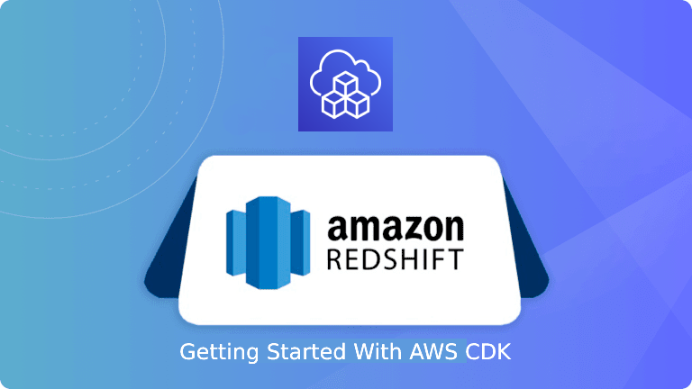

<p align="center">
  <a href="https://dev.to/vumdao">
    
  </a>
</p>
<h1 align="center">
  <div><b>AWS CDK Redshfit Demo</b></div>
</h1>

## Abstract
- For getting started with AWS Redshift, this post guides you to provide Redshift cluster and all necessary other resources such as VPC, redshift IAM role, S3 bucket where we load data to Amazon Redshift and a small EC2 instance as postgresql client using AWS CDK typescript.

## Table Of Contents
 * [AWS Redshift overview](#AWS-Redshift-overview)
 * [Redshift cluster stacks](#Redshift-cluster-stacks)
 * [Deploy stacks](#Deploy-stacks)
 * [Working with Redshift Cluster](#Working-with-Redshift-Cluster)
 * [Conclusion](#Conclusion)

---

## 🚀 **AWS Redshift overview** <a name="AWS-Redshift-overview"></a>
- AWS Redshift is a cloud-based petabyte-scale data warehouse service offered as one of Amazon’s ecosystem of data solutions.
- Based on PostgreSQL, the platform integrates with most third-party applications by applying its ODBC and JDBC drivers.
- Amazon Redshift delivers fast query performance by using columnar storage technology to improve I/O efficiency and parallelizing queries across multiple nodes
- Redshit cluster overview

  

- Node slices in compute nodes

  

## 🚀 **Redshift cluster stacks** <a name="Redshift-cluster-stacks"></a>
- The Redshift cluster is in VPC and under private subnet and security group, so we first create the VPC stack, and for saving cost, max `availabilityZones` is set to 1
  ```
  const vpc = new Vpc(this, `${prefix}-vpc`, {
      vpcName: `${prefix}-vpc`,
      maxAzs: 1
    });
  ```

- We will use S3 bucket to store JSON/parquet datas and then load data from S3 bucket to redshift cluster as following flow.

  

  - Redshift needs a role so that it can consume that role to download data from S3 bucket
    ```
    const s3 = new Bucket(this, `${prefix}-data-ingest`, {
      bucketName: `${prefix}-data-ingest`,
      encryption: BucketEncryption.S3_MANAGED,
      removalPolicy: RemovalPolicy.DESTROY,
      enforceSSL: true,
      blockPublicAccess: BlockPublicAccess.BLOCK_ALL
    });

    const role = new Role(this, `${prefix}-role`, {
      roleName: `${prefix}-role`,
      assumedBy: new ServicePrincipal('redshift.amazonaws.com')
    });
    s3.grantRead(role);
    ```

- In this post, the redshift cluster is in multi-node cluster with 2 compute nodes type `DC2_LARGE` (as default). `masterUser` is created with password stored in secret manager (as default option)
  ```
    const cluster = new Cluster(this, `${prefix}-cluster-demo`, {
      clusterName: `${prefix}-demo`,
      vpc: vpc,
      masterUser: {
        masterUsername: 'admin'
      },
      numberOfNodes: 2,
      clusterType: ClusterType.MULTI_NODE,
      removalPolicy: RemovalPolicy.DESTROY,
      roles: [role]
    });
  ```

- Finally, it's optional to create an EC2 instance as postgresql client to access redshift database (as we can use Amazon Redshift query editor). In practice, application will use JDBC URL to connect to Redshift cluster in private network. Back to the EC2 instance, it requires following:
  - Only small instance type such as `t3.small`
  - Allocated in private subnet of redshift VPC
  - Attached Security Group of the redshift cluster which already allow internal communication
  - Instance profile with only `AmazonSSMManagedInstanceCore` in order to start Amazon SSM agent
  - And `user-data.sh` script to install postgresql at frist start

  ```
    const clusterSg = cluster.connections.securityGroups[0];
    clusterSg.addIngressRule(clusterSg, Port.allTcp(), "Allow internal access Redshift");

    const ec2 = new Instance(this, `${prefix}-psql`, {
      instanceName: `${prefix}-psql`,
      vpc: vpc,
      securityGroup: clusterSg,
      instanceType: InstanceType.of(InstanceClass.T3, InstanceSize.SMALL),
      machineImage: new AmazonLinuxImage({generation: AmazonLinuxGeneration.AMAZON_LINUX_2}),
      role: new Role(this, `${prefix}-ec2-ssm`, {roleName: `${prefix}-ec2-ssm`, assumedBy: new ServicePrincipal('ec2.amazonaws.com'), managedPolicies: [{managedPolicyArn: 'arn:aws:iam::aws:policy/AmazonSSMManagedInstanceCore'}]})
    });

    const userData = readFileSync(resolve(__dirname, './user-data.sh'), 'utf8');
    ec2.addUserData(userData);
  ```

## 🚀 Deploy stacks <a name="Deploy-stacks"></a>
- Infrastructure of code for this project is ready we now deploy the stacks. It's up to you to use `concurrency` option for fasten deployment and `require-approval` to bypass confirmation of creating/updating/removing sensitive things.
  ```
  cdk deploy --concurrency 2 --require-approval never
  ```

- Check redshift cluster

  

- Go to secret manager to get master user password

  

- Overview of all components

  

## 🚀 Working with Redshift Cluster <a name="Working-with-Redshift-Cluster"></a>
- We use sample data in [data_sample/amzn_reviews_en.json](https://github.com/vumdao/cdk-redshift-demo/blob/master/data_sample/amzn_reviews_en.json), you can find more in [Amazon review data (2018)](http://deepyeti.ucsd.edu/jianmo/amazon/index.html)

- From the json file, we use `pyspark` to convert it to parquet format
  - **Overview of Parquet**: Parquet follows the Columnar Storage Model and is available to any project in the Hadoop Ecosystem. Unlike the traditional Sequential Storage Model where data is written in sequence, the Columnar Storage Model stores column values together. Although the Sequential Storage Model has advantages in processing transactions, it is not suitable for running Analytical Queries on Big Data.

  - Install `pyspark` by running `pip install pyspark`. Note that it also require java openjdk to use the tool

  - Covert json file to parquet.
    ```
    ⚡ $ cd data_sample/
    ⚡ $ pyspark
    Python 3.10.4 (main, Jun 29 2022, 12:14:53) [GCC 11.2.0] on linux
    Welcome to
          ____              __
        / __/__  ___ _____/ /__
        _\ \/ _ \/ _ `/ __/  '_/
      /__ / .__/\_,_/_/ /_/\_\   version 3.3.0
          /_/
    >>> df = spark.read.json("amzn_reviews_en.json")
    >>> print("Schema: {}".format(df.schema))
    >>> df.show()
    >>> df.write.parquet("amzn_reviews_en.parquet")
    ```

- Access EC2 instance by using SSM session
  ```
  ~ $ aws ssm start-session --target i-0be265f7c54177548 --region ap-southeast-1
  ```

- Connect redshift cluster database
  ```
  [root@ip-10-0-147-8 bin]# psql -h sin-d1-redshift-demo.cnozo5w39dmk.ap-southeast-1.redshift.amazonaws.com -U admin -p 5439 -d default_db
  Password for user admin:
  psql (10.17, server 8.0.2)
  SSL connection (protocol: TLSv1.2, cipher: ECDHE-RSA-AES256-GCM-SHA384, bits: 256, compression: off)
  Type "help" for help.

  default_db=#
  default_db=# \c prodreview
  prodreview=#
  ```

- Create json table view
  ```
  CREATE TABLE IF NOT EXISTS product_reviews_json(
  review_id           varchar(100)        NOT NULL distkey sortkey,
  product_id          varchar(100)        NOT NULL,
  stars               varchar(18)         NOT NULL,
  review_body         varchar(10000)      NOT NULL,
  review_title        varchar(1000)       NOT NULL,
  reviewer_id         varchar(128)        NOT NULL,
  language            varchar(20)         NOT NULL,
  product_category    varchar(100)        NOT NULL,
  primary key(review_id)
  );
  ```

- Create parquet table view
```
  CREATE TABLE IF NOT EXISTS product_reviews_parquet(
  language            varchar(20)         NOT NULL ENCODE lzo,
  product_category    varchar(100)        NOT NULL ENCODE lzo,
  product_id          varchar(100)        NOT NULL ENCODE lzo,
  review_body         varchar(10000)      NOT NULL ENCODE lzo,
  review_id           varchar(100)        NOT NULL distkey sortkey ENCODE lzo,
  review_title        varchar(1000)       NOT NULL ENCODE lzo,
  reviewer_id         varchar(128)        NOT NULL ENCODE lzo,
  stars               varchar(18)         NOT NULL ENCODE lzo,
  primary key(review_id)
  );
  ```

- Upload data `amzn_reviews_en.json` and `amzn_reviews_en.parquet` to S3 and then load them to redshift database

- Load `amzn_reviews_en.json` to the json table
  ```
  prodreview=# copy product_reviews_json
  prodreview-# FROM 's3://sin-d1-redshift-data-ingest/amzn_reviews_en.json'
  prodreview-# IAM_ROLE 'arn:aws:iam::123456789012:role/sin-d1-redshift-role'
  prodreview-# json 'auto ignorecase';
  INFO:  Load into table 'product_reviews_json' completed, 5000 record(s) loaded successfully.
  COPY
  ```

  ```
  prodreview=# SELECT COUNT(*) FROM product_reviews_json;
  count
  -------
    5000
  (1 row)
  ```

- Load `amzn_reviews_en.parquet` to parquet table
  ```
  prodreview=# copy product_reviews_parquet
  FROM 's3://sin-d1-redshift-data-ingest/amzn_reviews_en.parquet'
  IAM_ROLE 'arn:aws:iam::123456789012:role/sin-d1-redshift-role'
  format as parquet;
  INFO:  Load into table 'product_reviews_parquet' completed, 5000 record(s) loaded successfully.
  COPY
  ```

  ```
  prodreview=# SELECT COUNT(*) FROM product_reviews_parquet;
  count
  -------
    5000
  (1 row)
  ```

- Compare loading time
  ```
  select datediff(s,starttime,endtime) as duration,
  *
  from
  stl_query
  where query in (
      4231, /*  query id of json copy */
      4521 /*  query id of parquet copy */
  );
  ```


- RUN QUERIES: query data for the question: "Do people who buy kitchen and grocery items leave higher ratings?"
  ```
  prodreview=# SELECT stars, COUNT(stars) total_ratings FROM product_reviews_json WHERE product_category='kitchen' or product_category='grocery'
  prodreview-# GROUP BY stars;
  stars | total_ratings
  -------+---------------
  5     |            92
  2     |            78
  4     |            63
  1     |            72
  3     |            66
  (5 rows)

  prodreview=# SELECT stars, COUNT(stars) total_ratings FROM product_reviews_parquet WHERE product_category='kitchen' or product_category='grocery'
  GROUP BY stars;
  stars | total_ratings
  -------+---------------
  3     |            66
  5     |            92
  2     |            78
  4     |            63
  1     |            72
  (5 rows)
  ```

🚀 **Conclusion** <a name="Conclusion"></a>
- Here we have demonstrated how to create a redshift cluster and its ETL using CDK typescript, you can update the cluster as well as adding more S3 buckets or attach more roles to the redshift cluster for separte ETL processes through CDK stacks.
- If you want to destroy all the resources created by the stack, simply run `cdk destroy --all`

---

## References:
- [COPY examples](https://docs.aws.amazon.com/redshift/latest/dg/r_COPY_command_examples.html#copy-command-examples-manifest)
- [redshift-demo](https://github.com/miztiik/redshift-demo)
- [Parquet](https://www.databricks.com/glossary/what-is-parquet)

<h3 align="center">
  <a href="https://dev.to/vumdao">:stars: Blog</a>
  <span> · </span>
  <a href="https://github.com/vumdao/cdk-redshift-demo/">Github</a>
  <span> · </span>
  <a href="https://stackoverflow.com/users/11430272/vumdao">stackoverflow</a>
  <span> · </span>
  <a href="https://www.linkedin.com/in/vu-dao-9280ab43/">Linkedin</a>
  <span> · </span>
  <a href="https://www.linkedin.com/groups/12488649/">Group</a>
  <span> · </span>
  <a href="https://www.facebook.com/CloudOpz-104917804863956">Page</a>
  <span> · </span>
  <a href="https://twitter.com/VuDao81124667">Twitter :stars:</a>
</h3>
